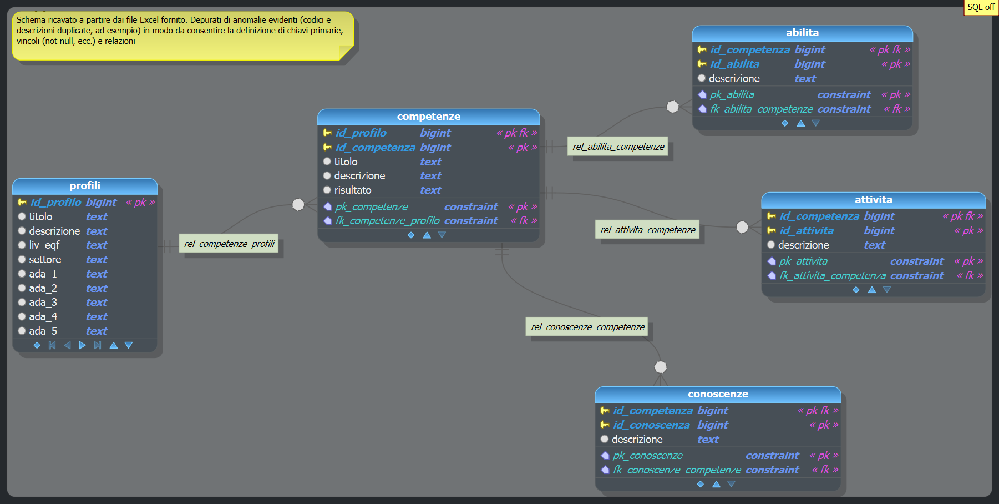

# Estrazione del Repertorio delle Qualificazioni Professionali della Regione Calabria

## Descrizione
L'estrazione eseguita rappresenta l'unione delle informazioni contenute nei file di origine in formato Excel (299) relativi al Repertorio delle Qualificazioni della Regione Calabria. Il Repertorio delle Qualificazioni regionali è l'elenco ufficiale dei profili professionali e delle competenze che ogni Regione italiana riconosce e certifica attraverso il proprio sistema di formazione professionale. Ogni profilo, ovvero Qualificazione è descritto in termini di conoscenze (sapere) e abilità/competenze (saper fare) necessarie per svolgere specifiche attività lavorative. Sebbene gestito a livello locale, il repertorio confluisce nel Quadro Nazionale delle Qualificazioni Regionali (QNQR). Questo garantisce che una qualifica ottenuta in una regione sia valida su tutto il territorio nazionale e trasparente per il riconoscimento in Europa (tramite il sistema EQF - European Qualifications Framework). Tutti i profili regionali e le loro corrispondenze nazionali sono altresì consultabili attraverso l'Atlante del Lavoro e delle Qualificazioni gestito dall'INAPP (https://www.inapp.gov.it/atlantelavoro/).

## Composizione dell'estrazione
L'estrazione è composta da 5 dataset collegati tra loro attraverso campi identificativi che ne garantiscono l'univocità e i relativi campi descrittivi, ognuno relativo al proprio dataset:
- profili
    - id_profilo
    - titolo
    - descrizione
    - liv_eqf
    - settore
    - ada_1..ada_47
- competenze
    - id_competenza
    - id_profilo
    - titolo
    - descrizione
    - risultato
- conoscenze
    - id_conoscenza
    - id_competenza
    -  descrizione
- attivita
    - id_attivita
    - id_competenza
    - descrizione
- abilita
    - id_abilita
    - id_competenza
    - descrizione

Le relazioni tra loro sono indicate nello schema seguente:  

## Descrizione
Da un esame della sola struttura dei dataset emerge che l'entità forte è la competenza (fa riferimento ad un profilo e a sua volta viene referenziata da conoscenza, attivita e abilita).  
I dataset profili, competenze e attivita sono coerenti (senza duplicati o ambiguità), mentre conoscenze e abilita presentano un'anomalia: a parità di identificativi (conoscenze: id_competenza+id_conoscenza, abilita: id_competenza+id_abilita) risultano descrizioni differenti, come da file csv allegati:  
. conoscenze_id_duplicati_descrizionidiverse.csv  
. abilita_id_duplicati_descrizionidiverse.csv  
  
## Note
### profili
Sono previsti fino a 47 codici ADA differenti. Il profilo con il maggior numero di codici indicati è quello con id_profilo=2012 (titolo:"Operatore addetto alle lavorazioni in filiere agroalimentari", descrizione: vuota) che ne ha 12.  

### competenze
Solo 3 competenze hanno un "risultato" indicato, tutte le altre non hanno questa informazione  

#### ADA/Risultati
Le Qualificazioni regionali (conenute nel dataset "profili") possono avere associate le c.d. "ADA-Aree di Attività", tratte dal sistma "Atlante del Lavoro e delle Qualificazioni" di INAPP. A loro volta le ADA possono essere accompgnate dai "risultati". Le ADA rappresentano la descrizione dettagliata dei compiti svolti da una professione, organizzata secondo una struttura gerarchica che parte dai Settori Economico-Professionali (SEP). In sintesi, ogni ADA include: descrizione delle attività (elenco dei compiti specifici che compongono quell'area); Risultati attesi: i prodotti o servizi che devono scaturire all'attività e i relativi standard di performance.

###### Corsi di formazione
Il dataset non contiene alcuna informazione su quanti corsi di formazione sono stati autorizzati e dunque attivati nel territorio della Regione Calabria.